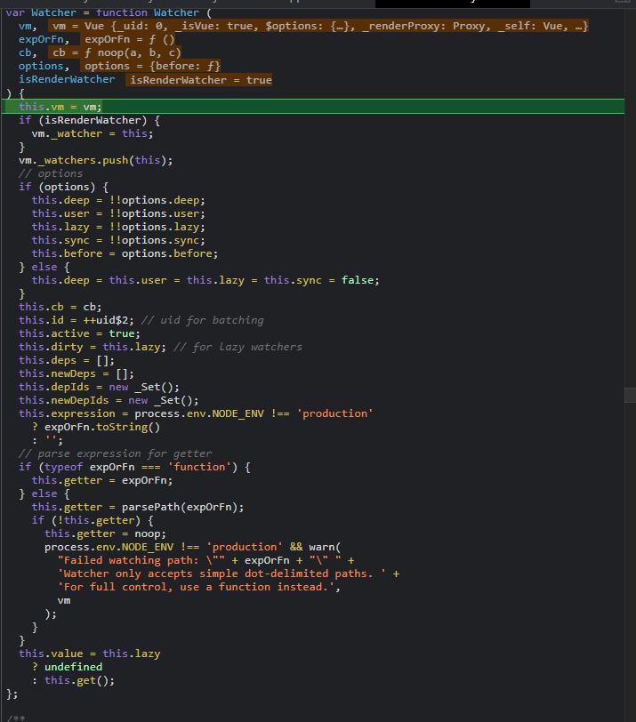
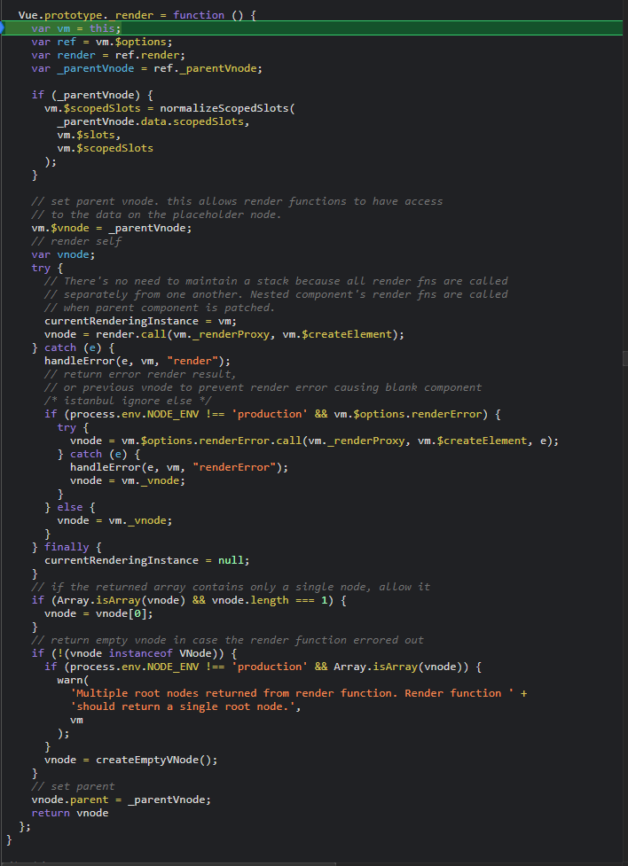
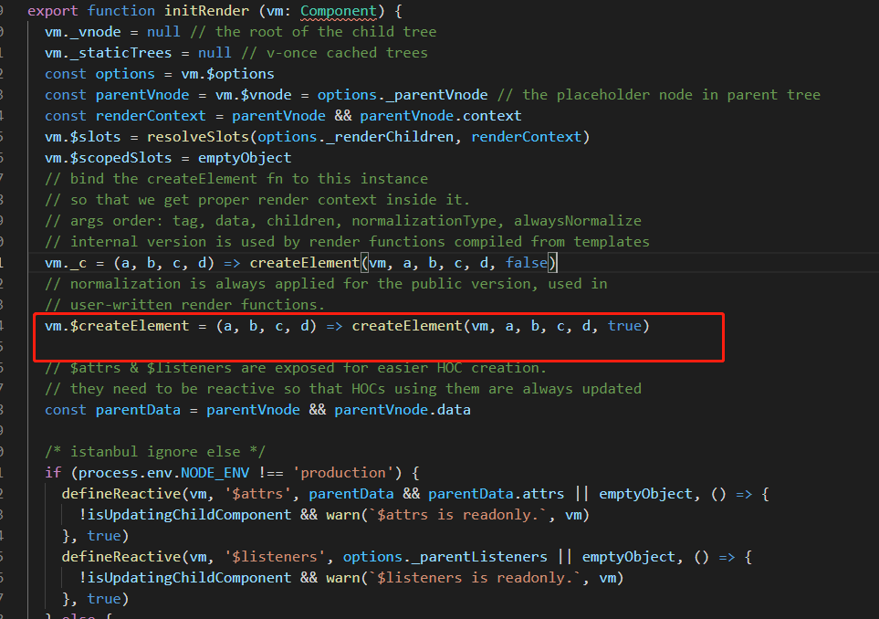
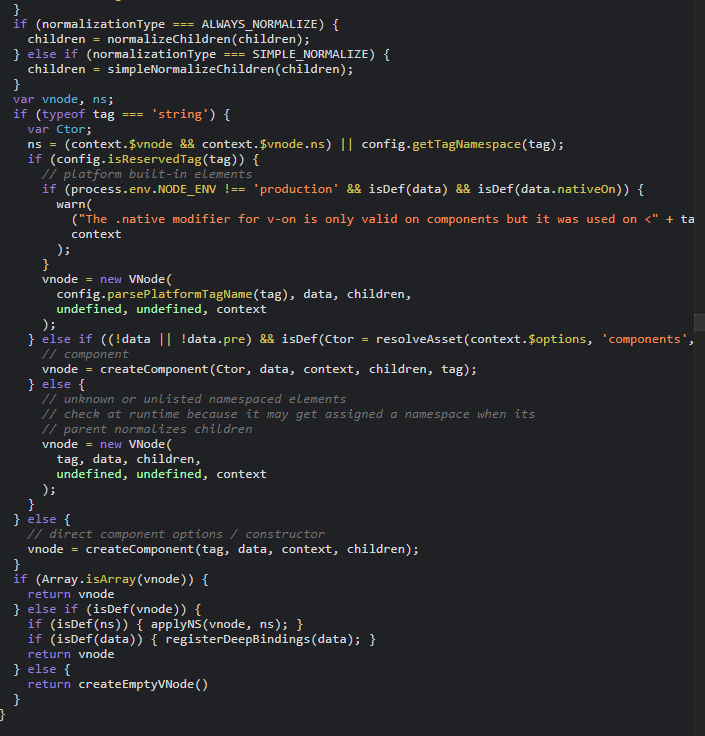

### Watcher 类
#### 渲染watcher

</br>

挂载阶段 new 一个 渲染watcher, 会执行  `get方法`

`Watcher.prototype.get`:

```
Watcher.prototype.get = function get () {
  pushTarget(this);
  var value;
  var vm = this.vm;
  try {
    value = this.getter.call(vm, vm);
  } catch (e) {
    if (this.user) {
      handleError(e, vm, ("getter for watcher \"" + (this.expression) + "\""));
    } else {
      throw e
    }
  } finally {
    // "touch" every property so they are all tracked as
    // dependencies for deep watching
    if (this.deep) {
      traverse(value);
    }
    popTarget();
    this.cleanupDeps();
  }
  return value
};
```

这个方法也就是执行 `getter()` 而 new Watcher 传入的 `updateComponent` 实参 就赋值给 getter 属性， watcher 其他的方法在 响应式那块介绍， 渲染 watcher 这块主要是执行 `updateComponent` 方法，


### updateComponent
```
updateComponent = function () {
    vm._update(vm._render(), hydrating);
};

```
</br> 

来看下 `vm.render`

</br>

`vnode = render.call(vm._renderProxy, vm.$createElement);`
这里的 `render` 指向的是 `vm.$options.render` 而我们在 `new-vue.md文件`就说了 初始化构建 调用`mergeOptions`合并了一次options,
所以这里的`render`就是用户传入 render 方法


`render(h) => h(App)` 这里的 h 指向就是 `vm.$createElement`,这个方法在 initRender 中定义的



图片中 `vm._c` 是对vue组件 `temaplate` 转换成 render 方法 执行的

`createElement` 最后执行了 `_createElement`  而 createElement 主要是对入参进行了判断， 目的是给用户传参提供了多样性，不会那么死板

`_createElement` 返回的是一个`vnode`对象,看下主要逻辑



这里 有个`children`,当我们用render方法渲染一个dom片段，形如</br>
```
{
    render(h){
        //children = '简单的文本'
        children = [
            h('div', '简单的文本'),
            ...
        ]
        return h('div')
    }
}
```
这里的children 就要去规范化了

```
 if (normalizationType === ALWAYS_NORMALIZE) {
    children = normalizeChildren(children);
  } else if (normalizationType === SIMPLE_NORMALIZE) {
    children = simpleNormalizeChildren(children);
  }
```
这里的 `simpleNormalizeChildren` 是 对render函数编译生成的

`normalizeChildren` 对单一的节点会执行 `createTextVNode`, 多个节点遍历执行创建 vnode,期间会递归执行。

最后，对第一个入参进行了判断，如果是个string `return new Vnode()` , 否则 调用 `createComponent`,我们这里传入的是app,一个对象
所以执行 createComponent

看下`createCompont`


