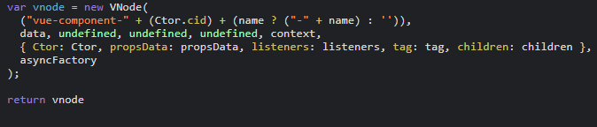
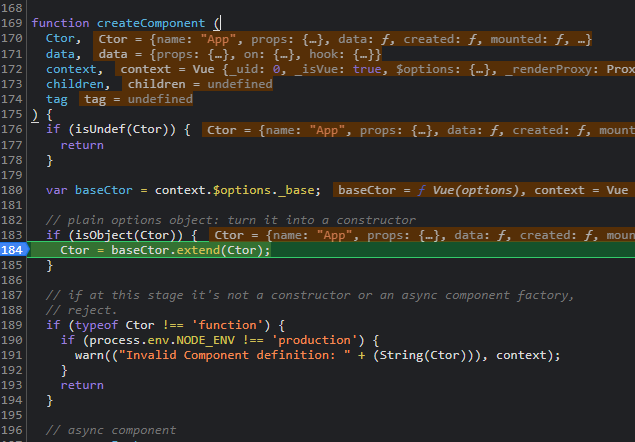
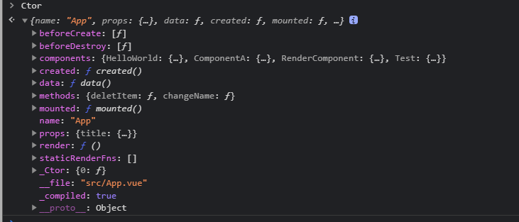
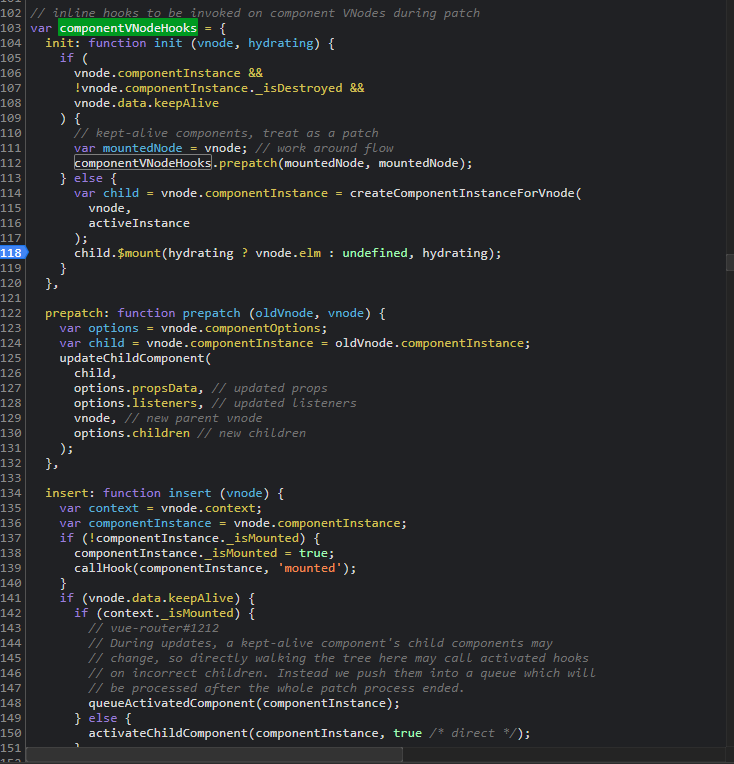

### 创建一个组件类型 的vnode

该方法最后返回一个 组件类型 vnode节点，对于 中间过程，我们主要分析这几个步骤
`createComponent` 方法 入参

这里面 `Ctor` 指的是 编译 过后的App组件 

对 `Ctor`对象 进行 extend, 目的就是将 Vue原型上的属性挂载到一个方法上 `Sub`， 并且将 `Ctor` 和 `Vue.options` 合并赋值给`Sub.options`,

校验获取propsData 存到 componentOptions 中：

` var propsData = extractPropsFromVNodeData(data, Ctor, tag);`

安装、合并 vnode hooks 钩子：
`installComponentHooks(data)`

这些钩子用于 vnode 在 patch阶段相应触发
