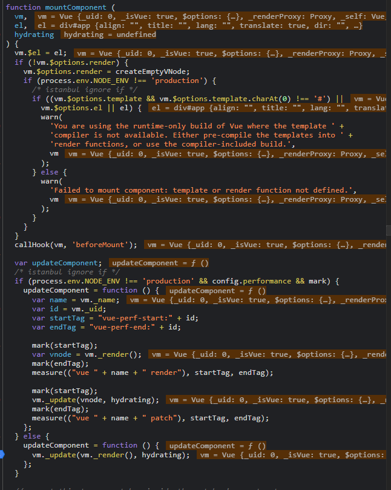

## 挂载执行

</br>

`mountComponent` 主要干了 new 一个 `watcher` 实例

```
// component's mounted hook), which relies on vm._watcher being already defined
  new Watcher(vm, updateComponent, noop, {
    before: function before () {
      if (vm._isMounted && !vm._isDestroyed) {
        callHook(vm, 'beforeUpdate');
      }
    }
  }, true /* isRenderWatcher */);

```

这里的 `updateComponent` 是个 `Function`
```
 updateComponent = function () {
      vm._update(vm._render(), hydrating);
    };

```

我们来看下 ` Watcher 类`