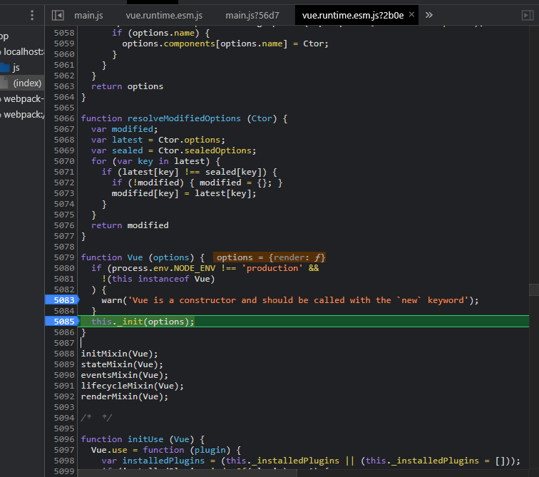
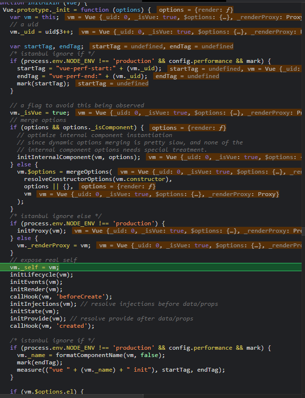
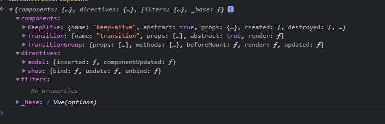

### 构建 vue 实例过程(new vue)
进入入口main.js文件
执行</br>
 ```
new Vue({
    render(h) => h(App)
}).$mount('#app')

```
### 执行 init 方法：
</br>
`inti 方法`主要做</br>
+ 初始化生命周期，
+ 事件中心
+ 初始化 state(props, data, methods , computed)
+ 初始化render

</br>


这里开始初始化构建会走else 逻辑，合并 options 对象</br>

这里的`vm.$options`对象将 `vm.constructor.options` 和 `options`对象合并到一起</br>
`vm.constructor.options` 挂载了内置组件，内置指令， 过滤器</br>


</br>

`init 方法主要做了如下`

```
initLifecycle(vm);
initEvents(vm);
initRender(vm);
callHook(vm, 'beforeCreate');
initInjections(vm); // resolve injections before data/props
initState(vm);
initProvide(vm); // resolve provide after data/props
callHook(vm, 'created');
```
</br>

数据实现响应式就是在 `initState(vm)` 中执行的， 这里先不讲，
后面就是mount挂载阶段， 如果有 el 选项就自动挂载，我们这里手动挂载


```
Vue.prototype.$mount = function (
  el,
  hydrating
) {
  el = el && inBrowser ? query(el) : undefined;
  return mountComponent(this, el, hydrating)
};
```
执行 `mountComponent`
