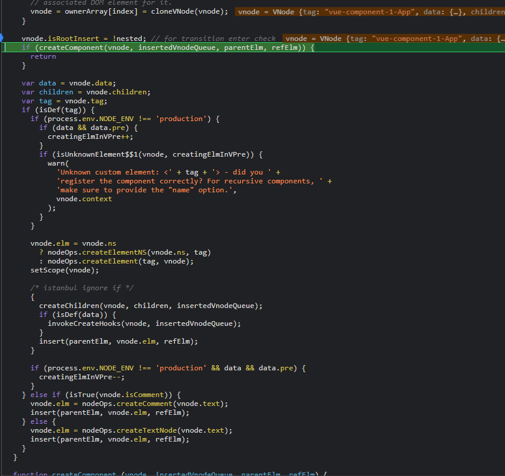
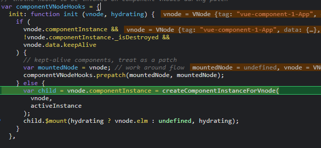
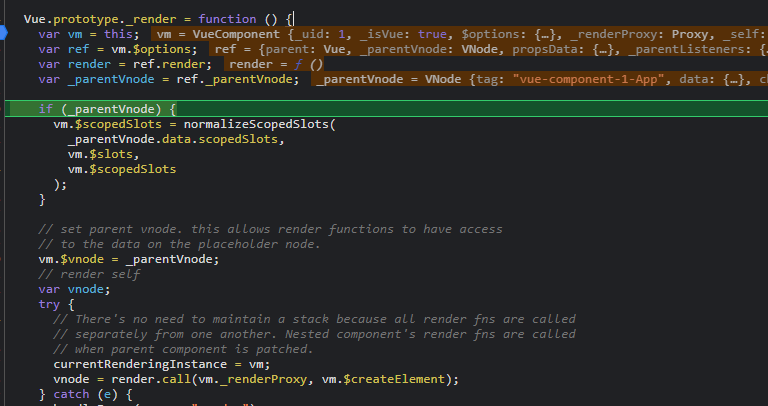
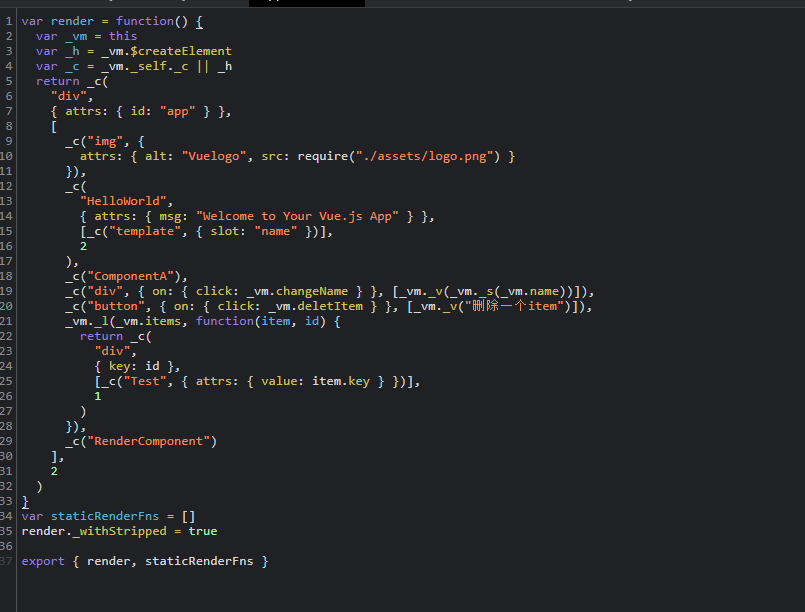
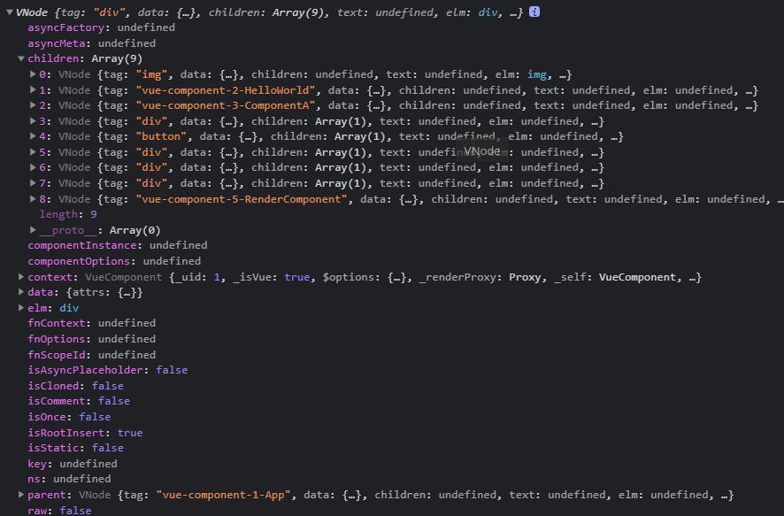

## patch
代码路径 `vue\src\core\vdom\patch.js`
```
return function patch (oldVnode, vnode, hydrating, removeOnly) {
    if (isUndef(vnode)) {
      if (isDef(oldVnode)) invokeDestroyHook(oldVnode)
      return
    }

    let isInitialPatch = false
    const insertedVnodeQueue = []

    if (isUndef(oldVnode)) {
      // empty mount (likely as component), create new root element
      isInitialPatch = true
      createElm(vnode, insertedVnodeQueue)
    } else {
      const isRealElement = isDef(oldVnode.nodeType)
      if (!isRealElement && sameVnode(oldVnode, vnode)) {
        // patch existing root node
        patchVnode(oldVnode, vnode, insertedVnodeQueue, null, null, removeOnly)
      } else {
        if (isRealElement) {
          // mounting to a real element
          // check if this is server-rendered content and if we can perform
          // a successful hydration.
          if (oldVnode.nodeType === 1 && oldVnode.hasAttribute(SSR_ATTR)) {
            oldVnode.removeAttribute(SSR_ATTR)
            hydrating = true
          }
          if (isTrue(hydrating)) {
            if (hydrate(oldVnode, vnode, insertedVnodeQueue)) {
              invokeInsertHook(vnode, insertedVnodeQueue, true)
              return oldVnode
            } else if (process.env.NODE_ENV !== 'production') {
              warn(
                'The client-side rendered virtual DOM tree is not matching ' +
                'server-rendered content. This is likely caused by incorrect ' +
                'HTML markup, for example nesting block-level elements inside ' +
                '<p>, or missing <tbody>. Bailing hydration and performing ' +
                'full client-side render.'
              )
            }
          }
          // either not server-rendered, or hydration failed.
          // create an empty node and replace it
          oldVnode = emptyNodeAt(oldVnode)
        }

        // replacing existing element
        const oldElm = oldVnode.elm
        const parentElm = nodeOps.parentNode(oldElm)

        // create new node
        createElm(
          vnode,
          insertedVnodeQueue,
          // extremely rare edge case: do not insert if old element is in a
          // leaving transition. Only happens when combining transition +
          // keep-alive + HOCs. (#4590)
          oldElm._leaveCb ? null : parentElm,
          nodeOps.nextSibling(oldElm)
        )

        // update parent placeholder node element, recursively
        if (isDef(vnode.parent)) {
          let ancestor = vnode.parent
          const patchable = isPatchable(vnode)
          while (ancestor) {
            for (let i = 0; i < cbs.destroy.length; ++i) {
              cbs.destroy[i](ancestor)
            }
            ancestor.elm = vnode.elm
            if (patchable) {
              for (let i = 0; i < cbs.create.length; ++i) {
                cbs.create[i](emptyNode, ancestor)
              }
              // #6513
              // invoke insert hooks that may have been merged by create hooks.
              // e.g. for directives that uses the "inserted" hook.
              const insert = ancestor.data.hook.insert
              if (insert.merged) {
                // start at index 1 to avoid re-invoking component mounted hook
                for (let i = 1; i < insert.fns.length; i++) {
                  insert.fns[i]()
                }
              }
            } else {
              registerRef(ancestor)
            }
            ancestor = ancestor.parent
          }
        }

        // destroy old node
        if (isDef(parentElm)) {
          removeVnodes([oldVnode], 0, 0)
        } else if (isDef(oldVnode.tag)) {
          invokeDestroyHook(oldVnode)
        }
      }
    }

    invokeInsertHook(vnode, insertedVnodeQueue, isInitialPatch)
    return vnode.elm
  }

```
对于`首次patch`, oldVnode 是 dom对象 所以走 else 逻辑 ，执行 `createEle` 

```
createElm(
    vnode,
    insertedVnodeQueue,
    // extremely rare edge case: do not insert if old element is in a
    // leaving transition. Only happens when combining transition +
    // keep-alive + HOCs. (#4590)
    oldElm._leaveCb ? null : parentElm,
    nodeOps.nextSibling(oldElm)
);
```

`createEle` 主要由 vnode 来创建 dom对象插入到 parentEle



对于组件类型的 vnode 的话执行  `createComponent(vnode, insertedVnodeQueue, parentElm, refElm`

```

function createComponent (vnode, insertedVnodeQueue, parentElm, refElm) {
    let i = vnode.data
    if (isDef(i)) {
      const isReactivated = isDef(vnode.componentInstance) && i.keepAlive
      if (isDef(i = i.hook) && isDef(i = i.init)) {
        i(vnode, false /* hydrating */)
      }
      // after calling the init hook, if the vnode is a child component
      // it should've created a child instance and mounted it. the child
      // component also has set the placeholder vnode's elm.
      // in that case we can just return the element and be done.
      if (isDef(vnode.componentInstance)) {
        initComponent(vnode, insertedVnodeQueue)
        insert(parentElm, vnode.elm, refElm)
        if (isTrue(isReactivated)) {
          reactivateComponent(vnode, insertedVnodeQueue, parentElm, refElm)
        }
        return true
      }
    }
  }

```

这个方法主要是执行 vnode hooks `init` 方法
`init` 方法在 生成 componentVnode 执行 `installComponentHooks(data)`



`var child = vnode.componentInstance = createComponentInstanceForVnode(vnode,activeInstance);`
这里 的 `activeInstance`就是当前的vue实例  
在 `update 方法中` 执行 ` var restoreActiveInstance = setActiveInstance(vm);`

```
    function createComponentInstanceForVnode (
    vnode, // we know it's MountedComponentVNode but flow doesn't
    parent // activeInstance in lifecycle state
    ) {
    var options = {
        _isComponent: true,
        _parentVnode: vnode,
        parent: parent
    };
    // check inline-template render functions
    var inlineTemplate = vnode.data.inlineTemplate;
    if (isDef(inlineTemplate)) {
        options.render = inlineTemplate.render;
        options.staticRenderFns = inlineTemplate.staticRenderFns;
    }
    return new vnode.componentOptions.Ctor(options)
    }
```

`vnode.componentOptions.Ctor` 这其实 是 Vue的 子类构造器，在 `createComponent.md `文件中继承 Vue,
所以现在 继续 走一遍 子组件 构建过程

当执行 到 `Vue.prototype._init()` 和首次执行是不一样的， 这里的子类构造器 在 new 一个 Vue 子类实例的时候传入的 `options`是针对 组件的
```
var options = {
    _isComponent: true,
    _parentVnode: vnode,
    parent: parent
  };
```
所以会执行 `initInternalComponent(vm, options);`
```

function initInternalComponent (vm, options) {
  var opts = vm.$options = Object.create(vm.constructor.options);
  // doing this because it's faster than dynamic enumeration.
  var parentVnode = options._parentVnode;
  opts.parent = options.parent;
  opts._parentVnode = parentVnode;

  var vnodeComponentOptions = parentVnode.componentOptions;
  opts.propsData = vnodeComponentOptions.propsData;
  opts._parentListeners = vnodeComponentOptions.listeners;
  opts._renderChildren = vnodeComponentOptions.children;
  opts._componentTag = vnodeComponentOptions.tag;

  if (options.render) {
    opts.render = options.render;
    opts.staticRenderFns = options.staticRenderFns;
  }
}

```
这里的 `options._parentVnode` 对应的是 父 vnode对象
`options.parent` 对应的是 父实例对象 也就是 activeInstance 

接下来就是 自动调用 `child.$mount()`
执行到 组件 的 `render` 方法



这里 的 vm 其实起是 `child`
`vnode = render.call(vm._renderProxy, vm.$createElement);`
所以这里的 `render` 是该组件的 render属性

vue组件 中 template 被编译成的结果



组件 `render()` 的 `vnode` 结构如下



此时该 `vnode` 已经 从 `组件类型vnode` -> `普通 vnode`对象

<!-- 此时 children 数组 每个元素都是 vnode 类型，但有些 元素的 children 是 undefined  -->

此时有些 children 数组 每个 都是 vnode类型 ，有些事组件 类型 有些事 普通 vnode

接下来执行 `vnode`  的 `patch` 操作


## component Patch 

首次patch 都执行 ` vm.$el = vm.__patch__(vm.$el, vnode, hydrating, false /* removeOnly */);`,
但组件 的 首次patch 的 `$el` 是 undefined ,这个 在 组件 的 时候，它传的 就是 undefined,在 `createComponent.md` 中 `componentVnodeHooks` 中 的init 方法执行的， 后面就继续执行 `createEle`

当前组件（`当前组件已是 vnode`） patch 操作主要,

这里有个`重要步骤`，如果当前的 vnode 是 `组件类型 vnode` 就执行 `createComponent` 方法，
这个方法和 之前讲的 `createComponent.md`文件不一样, 这个 主要是执行 `componentVnodeHooks` 的 `init` 方法，new 一个 子类构造器，
所以children 元素 的 `所有组件类型 vnode 都在这步深度实例化完`

如果当前只是 `普通vnode` 就创建一个标签 赋值 给 `$el`,如果有 children, 则遍历执行 `createEle`

createEle 中代码
```
 /* istanbul ignore if */
    {
      createChildren(vnode, children, insertedVnodeQueue);
      if (isDef(data)) {
        invokeCreateHooks(vnode, insertedVnodeQueue);
      }
      insert(parentElm, vnode.elm, refElm);
    }

```
这里的 createChildren 就是 children 若是 数组遍历执行 `createEle` 
否则 若是文本vnode 创建一个文本节点并插入  
`nodeOps.appendChild(vnode.elm, nodeOps.createTextNode(String(vnode.text)));`


`invokeCreateHooks(vnode, insertedVnodeQueue);` 主要做 

<font size=3>`updateAttrs", "updateClass", 
"updateDOMListeners", "updateDOMProps", "updateStyle", "_enter", "create", "updateDirectives`</font>

属性更新，calss 更新， 事件监听， style 等等一系列的更新，
执行完这一系列更新操作后 就 插入到 parentElm

<font size=3>`insert(parentElm, vnode.elm, refElm);` </font>

看下 `insert`

```
function insert (parent, elm, ref$$1) {
    if (isDef(parent)) {
      if (isDef(ref$$1)) {
        if (nodeOps.parentNode(ref$$1) === parent) {
          nodeOps.insertBefore(parent, elm, ref$$1);
        }
      } else {
        nodeOps.appendChild(parent, elm);
      }
    }
  }

```
就是一个原生插入dom的过程

## 总结
所以，patch 操作就是把 `vnode` -> 转成 真是`dom`, 
`转成 真实dom的前提是` <font color=red size=4>这个vnode已经变成普通的vnode</font>,
对存在的children 属性也进行次 `createEle`遍历（把每个普通vnode变成真实dom）
而对于<font size=4 color=red>组件类型 vnode</font> 则实例化他们，

在ptach 操作中 parentEle 变化 过程
从一开始 的 ` #app` <- app.vue组件 的 第一个 dom <- 每个子组件 的 第一个 dom, 
因为 patch 是 自下而上的 所以 最后一步是插入模板（index.html）`div#app` dom元素上 
