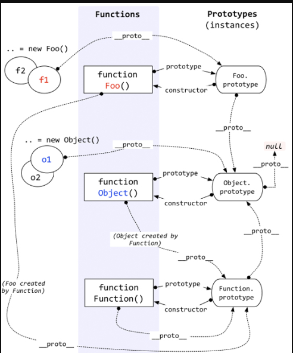

### 描述
__proto__ 属性指向继承的原型对象， __proto__ 形成的链就叫继承链(原型链继承)
### 相关属性
+ __proto__(对象): 指向继承的原型对象
+ prototype(函数): 指向constructor(构造函数)的原型对象
+ constructor : 构造函数
函数也是对象
### 继承
```
  var A = function() {}
  A.prototype = {
    say: function() {},
    name: 'yuanxing'
  }
  var instance = new A()
  instance.name // 'yuanxing'
  // 生成的实例可以访问 A.prototype 
```
### 原型链

```
var A = function() {}
A.prototype.name = 'A'
var Ainstance = new A()

Ainstance.__proto__ ——> A.prototype

A.prototype.__proto__ ——> Object.prototype

Object.prototype.__proto__ ——> null

```
##### 构造函数A
上面的构造函数A继承链
```
构造函数A既是函数也是对象
A.__proto___ ——> Function.prototype
// 所以等同构造函数对象是 new Function得来的
// 所以A 可以调用 apply, call , bind等函数

Function.prototype.__proto__ ——> Object.prototype

Object.prototype.__proto__ ——> null

A.prototype ——> {constructor: A, __proto__: Object.prototype} 

```
### 图解
