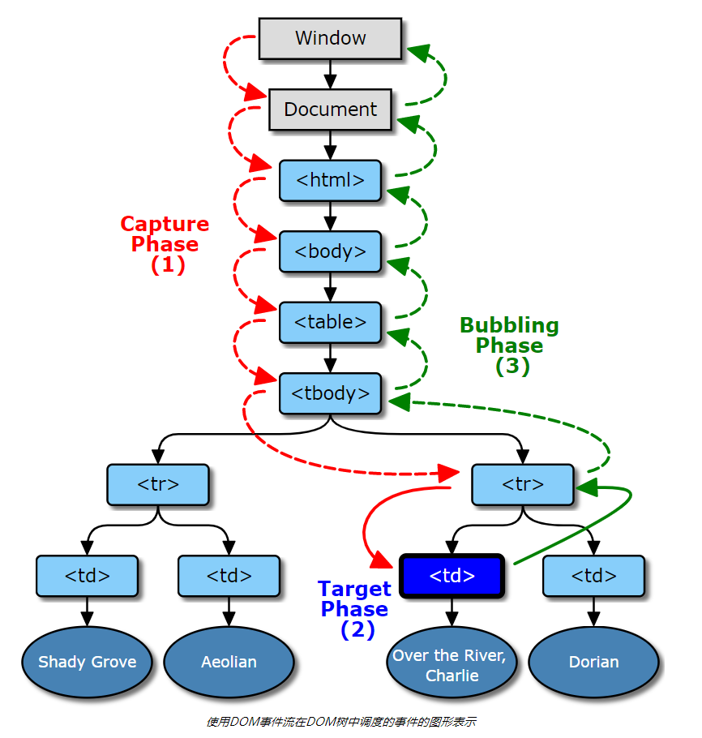

## 事件机制（event-flow）
浏览器Dom事件流分为三个阶段：
+ 捕获阶段
+ 目标阶段
+ 冒泡阶段

### 捕获阶段:
事件从window向事件触发处传播
### 目标阶段:
事件对象到达事件的目标，此阶段称为目标阶段， 如果事件类型不会冒泡，则事件对象在此阶段完成后停止
### 冒泡阶段:
与冒泡阶段相反，事件从事件触发处向window 传播

### 图片展示

### 事件注册
一般用addEventListener 注册
target.addEventListener(type, listener, options);
target.addEventListener(type, listener, useCapture);
这里的 useCaptrue :boolean
 + true： 表示该事件在捕获阶段会触发 listener
 + false: 表示该事件在冒泡阶段触发 listener
这里的 options 对象参数
 + captrue 同 useCaptrue 一样
 + once :boolean 为 true 时 调用一次，该 listener 会自动移除
 + passive :boolean 值为true,表示不会触发 preventDefault()
### event.stopPropagation 
用来阻止事件传播的，一般用来阻止冒泡，其实捕获也可以阻止
### event.preventDefault 
阻止事件的默认行为，例如链接跳转行为

### 相关文档
[地址](https://www.w3.org/TR/DOM-Level-3-Events/#event-flow)